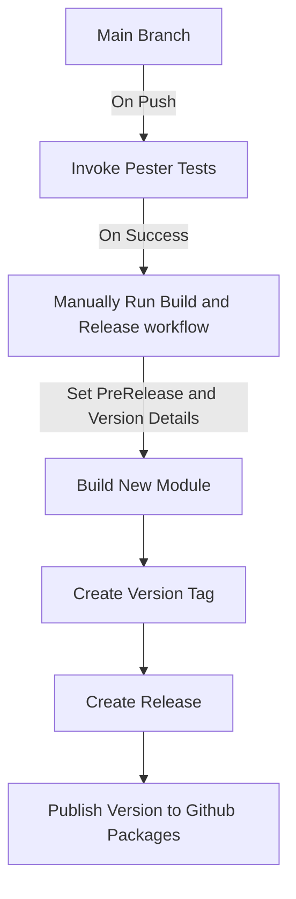

# ModuleForge.Test.Public

## What is this?

This is an example PowerShell module that is built with [ModuleForge](https://github.com/adrian-andersson/ModuleForge). It is an example module used to show how to structure files, pester tests, and use github actions and ModuleForge to "compile" a module, and automatically create a tag and release for the version, and upload the nupkg to Github Packages.

## What is included in this example module

It includes the following module functions:

- Two Class Files
  - AlienVisitor
  - GalacticAmbassador
- One Enum File
  - SpaceSuitType
- One Private Function
  - Get-AlienVisitorWelcome
- Four Functions/Exported Commands
  - Get-GalacticAmbassador
  - Get-GalacticReception
  - New-AlienVisitor
  - Start-Blastoff
- Three Pester Tests
  - Get-GalacticReception.Tests
  - New-AlienVisitor.Tests
  - Start-Plastoff.Tests
- Two GH Actions Workflows
  - A workflow to invoke-pester on a push to 'main' branch automatically
  - A Build and Release workflow that can be run manually, with dropdown options for what version actions to take

## Usage

Please feel free to copy/replicate whatever you like from this module, it exists as an example of how to use the ModuleForge PowerShell Module to help you build and deploy your own PowerShell modules and set up CI/CD pipelines.

> You may find a few existing releases and package versions for this module. There should be no difference between versions, they exist only to test the workflow versioning works as expected.

## How does the Workflow operate?

Here is a Mermaid chart to try and show the process



## I want to try this module

If you want to, sure thing. The easiest way will be:

1. Go to the 'Releases' section of this repository
2. Download the latest 'nupkg' file
3. Rename the nupkg so it has a .zip extension
4. Place it in your Module folder
5. Use PowerShell `get-help` to discover how to use this module

## How do I use your demo module

Here's a quick demonstration of the module in action. The output of each command has been commented out:

### Import the module

```PowerShell
import-module astrocmdlets
```

Input:

```PowerShell
get-module astrocmdlets
```

Result:

```PowerShell
Name              : astrocmdlets
Path              : C:\Users\ANDERSSONA\OneDrive -
                    Ventia\Documents\PowerShell\Modules\astrocmdlets\2.0.0\AstroCmdlets.psm1
Description       : A test module
ModuleType        : Script
Version           : 2.0.0
PreRelease        :
NestedModules     : {}
ExportedFunctions : {Get-GalacticAmbassador, Get-GalacticReception, New-AlienVisitor, Start-Blastoff}
ExportedCmdlets   :
ExportedVariables :
ExportedAliases   : blastOff
```

### Get the module Commands

Input:

```PowerShell
get-command -Module astrocmdlets
```

Result:

```PowerShell
Name        : Get-GalacticAmbassador
CommandType : Function
Definition  :
                  param (
                      [string]$Name = "Zarnak",
                      [string]$HomePlanet = "Nebula-7",
                      [string]$FavoriteFood = "Quantum Quinoa",
                      [string]$Title = "Celestial Diplomat"
                  )

                  $ambassador = [GalacticAmbassador]::new($Name, $HomePlanet, $FavoriteFood, $Title)
                  $ambassador.GetIntroduction()


Name        : Get-GalacticReception
CommandType : Function
Definition  :
                  param (
                      [AlienVisitor]$Visitor = $null
                  )

                  if (-not $Visitor) {
                      # Summon a default alien visitor
                      $Visitor = New-AlienVisitor -Name "Zog" -HomePlanet "Xenon-9" -FavoriteFood "Quantum Quinoa"
                  }

                  # Welcome the visitor
                  Get-AlienVisitorWelcome -Visitor $Visitor


Name        : New-AlienVisitor
CommandType : Function
Definition  :
                  param (
                      [string]$Name,
                      [string]$HomePlanet,
                      [ValidateAlienFoodAttribute()]
                      [string]$FavoriteFood
                  )

                  $alien = [AlienVisitor]::new($Name, $HomePlanet, $FavoriteFood)
                  return $alien


Name        : Start-Blastoff
CommandType : Function
Definition  :
                  param (
                      [string]$RocketName,
                      [SpaceSuitType]$AstronautSuit
                  )

                  "Countdown initiated for rocket '$RocketName'..."
                  "Astronauts are suiting up in their $AstronautSuit spacesuits."
                  #Start-Sleep -Seconds 3
                  3..1 | ForEach-Object {
                      "T-minus $_ seconds..."
                      Start-Sleep -milliseconds 200
                  }
                  "🚀 Launch successful! '$RocketName' has reached orbit!"

```

### Run the commands

Input:

```PowerShell
Get-GalacticAmbassador
```

Result:

```PowerShell
Greetings, Earthlings! I am Zarnak from planet Nebula-7. My favorite food here is Quantum Quinoa.
 I am the Galactic Ambassador, holding the esteemed title of Celestial Diplomat.
```

Input:

```PowerShell
Get-GalacticReception
```

Resut:

```PowerShell
Greetings, Earthlings! I am Zog from planet Xenon-9. My favorite food here is Quantum Quinoa.
```

Input:

```PowerShell
New-AlienVisitor -Name Frank -FavoriteFood 'Quantum Quinoa' -HomePlanet 'Hxzor-4'
```

Result:

```PowerShell
Name  HomePlanet FavoriteFood
----  ---------- ------------
Frank Hxzor-4    Quantum Quinoa
```

Input:

```PowerShell
Start-Blastoff -RocketName 'The PizzaTray'
```

Result:

```PowerShell
T-minus 3 seconds...
T-minus 2 seconds...
T-minus 1 seconds...
🚀 Launch successful! 'The PizzaTray' has reached orbit!
```
